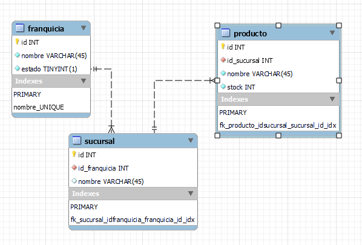
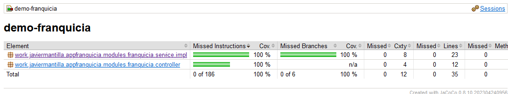

## DOCUMENTACION PROYECTO PRUEBA TECNICA

Manejo de Franquicias, sucursales, productos.

## Modelo ER
 

## Despliegue entorno local PDF

[Documento de ejecución y despligue local](resources/DESPLIEGUE-ENTORNO-LOCAL.pdf)

## Proceso de montaje del proyecto 

1. En la carpeta /database/Fanquicia20240915.sql, se encuentra el Script de montaje de la base de datos en MYSQL

2. En la carpeta /postman, Se ecuentra el proyecto con todos los servicios requeridos para la funcionalidad  

## Pruebas unitarias de cobertura

## License

[MIT](https://choosealicense.com/licenses/mit/)
